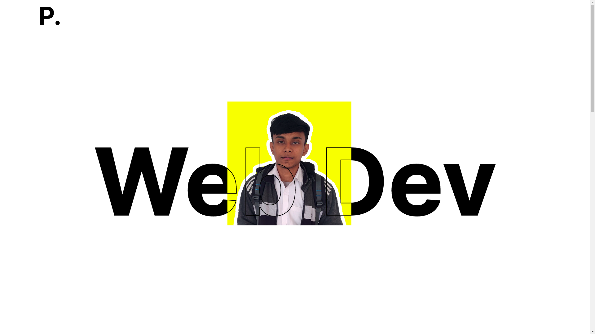

# Portfolio Website Project

I made this portfolio website project using HTML5, CSS3.
This website is a responsive website.

## Note

You can get extra CSS3 code

## Clone this Project

So, if you want to use my source code then clone this project. To clone use this command

```
git clone https://github.com/priyankarpal/priyankar.git
```

## Tech Stack

<p align="Center"> 


</p>

<h1 align="center"> Connect with me 🤝</h1>

<p align="Center"> 
<a href="https://www.github.com/priyankarpal" target="_blank" rel="noreferrer"></a> 
<a href="https://priyankarpal.hashnode.dev" target="_blank" rel="noreferrer"></a> 
<a href="http://www.instagram.com/priyankarpal1" target="_blank" rel="noreferrer"></a> 
<a href="https://www.linkedin.com/in/priyankarpal" target="_blank" rel="noreferrer"></a> 
<a href="https://www.twitter.com/priyankarpal" target="_blank" rel="noreferrer"></a>
</p>

## Website Image



https://user-images.githubusercontent.com/88102392/211541713-fd45fe4d-7344-40b0-93a6-39dcaf6f7d5f.mp4

